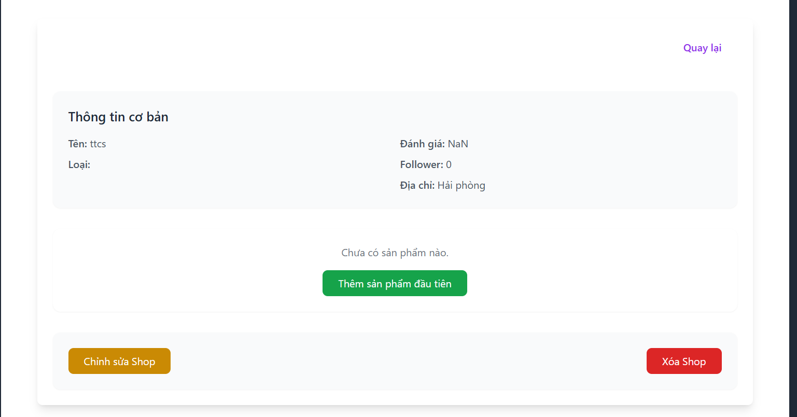
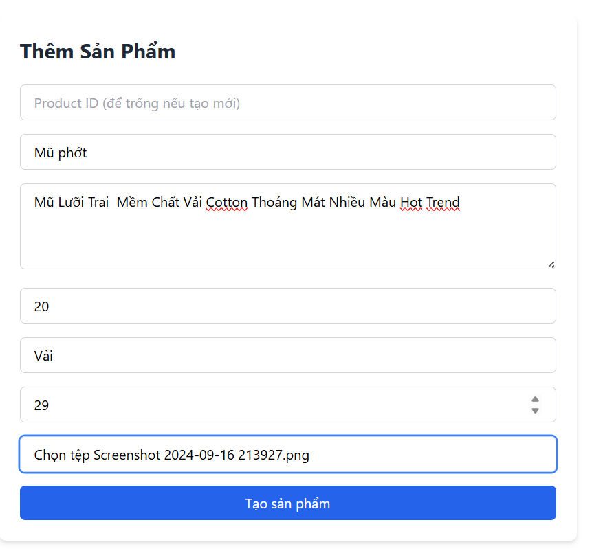

## Dự án web bán hàng 

## Cấu trúc source code

```bash
ttcs/
└── my-app/
    ├── public/                # Thư mục chứa các file tĩnh (favicon, ảnh, v.v.)
    ├── src/                   # Thư mục mã nguồn chính
    │   ├── assets/            # Tài nguyên tĩnh (ảnh, svg, ...)
    │   ├── components/        # Các component dùng chung và theo chức năng
    │   │   ├── ProductList.jsx
    │   │   ├── DeleteShop/
    │   │   ├── Logout/
    │   │   ├── CreateRating/
    │   │   ├── Order/
    │   │   ├── AddtoCart/
    │   │   ├── DetailProduct/
    │   │   ├── ChangePassword/
    │   │   ├── EditProfile/
    │   │   ├── User/
    │   │   ├── ForgotPassword/
    │   │   ├── EditProduct/
    │   │   ├── DeleteProduct/
    │   │   ├── CreateProduct/
    │   │   ├── InfoShop/
    │   │   ├── EditShop/
    │   │   └── CreateShop/
    │   ├── pages/             # Các trang chính của ứng dụng
    │   │   ├── Cart/
    │   │   ├── Login/
    │   │   ├── Verify/
    │   │   ├── Register/
    │   │   ├── NotFound/
    │   │   ├── About/
    │   │   └── Home/
    │   ├── utils/             # Các hàm tiện ích, xử lý logic chung
    │   │   ├── manager.jsx
    │   │   └── request.jsx
    │   ├── redux/             # Quản lý state với Redux
    │   │   ├── authReducer.jsx
    │   │   └── index.jsx
    │   ├── action/            # Các action cho Redux
    │   │   └── authAction.jsx
    │   ├── hooks/             # Custom React hooks
    │   │   ├── useDebounce.js
    │   │   ├── useToggle.js
    │   │   ├── useLocalStorage.js
    │   │   ├── useClickOutside.js
    │   │   └── useMediaQuery.js
    │   ├── layouts/           # Các layout tổng thể cho trang
    │   │   └── index.jsx
    │   ├── styles/            # Các file style (CSS, SCSS, ...)
    │   ├── App.jsx            # File App chính
    │   ├── App.css            # Style cho App
    │   ├── main.jsx           # Điểm vào của ứng dụng React
    │   └── index.css          # Style tổng thể
    ├── index.html             # File HTML gốc
    ├── package.json           # Thông tin và dependencies của dự án
    ├── package-lock.json      # Quản lý version dependencies
    ├── vite.config.js         # Cấu hình Vite
    ├── eslint.config.js       # Cấu hình ESLint
    └── .gitignore             # Các file/thư mục bị loại trừ khỏi git
```

## Hướng dẫn cài đặt & Chạy chương trình

### Backend

- Sử dụng framework Java Spring Boot nên máy tính cần cài đặt:
  - JDK
  - Maven
  - IDE IntelliJ IDEA
  - MySQL Workbench

- Tạo CSDL trên MySQL Workbench (tài khoản và mật khẩu cấu hình trong `application.yml`)
- Chạy chương trình trên IntelliJ IDEA

### Frontend

- Dùng ReactJS + Vite, cần cài:
  - Node.js
  - Visual Studio Code

- Chạy chương trình:
  - Mở terminal, vào thư mục `Client`
  - Chạy:
    ```bash
    npm install
    npm run dev
    ```

### Truy cập

- Website: `http://localhost:5173`
- API backend: `http://localhost:8081` (test bằng Postman)

---

## Sử dụng chương trình

### a. Giao diện khi truy cập


---

### b. Đăng ký / Đăng nhập


- Chọn vai trò: `User` (khách hàng) hoặc `Manager` (quản lý)
- Nhấn Sign up → chuyển sang trang Verify


- Xác thực thành công → về trang Login


---

### c. Chỉnh sửa Profile

- Đổi mật khẩu:
  

- Chỉnh sửa thông tin:
  

---

### d. Tìm kiếm & tương tác sản phẩm

- Tìm kiếm:
  

- Chi tiết sản phẩm:
  

- Follow shop:
  

- Đánh giá:
  

---

### e. Giỏ hàng

- Thêm vào giỏ:
  

- Đặt hàng để cập nhật trạng thái & thời gian giao hàng

---

### f. Tạo shop & quản lý sản phẩm (dành cho Manager)

- Giao diện quản lý:
  

- Tạo shop:
  

- Xem thông tin shop:
  

- Sửa shop:
  

- Thêm sản phẩm:
  

---

## 5.3 Cắt giao diện

### 1. Mục tiêu

Dựng giao diện từ bản thiết kế Figma, dùng Tailwind CSS để đảm bảo:

- Tính linh hoạt
- Dễ bảo trì
- Tối ưu hiệu suất

### 2. Công cụ sử dụng

- Figma
- Tailwind CSS
- VS Code

### 3. Quy trình

- Phân tích UI từ Figma: header, navbar, content, footer
- Chuyển qua HTML + Tailwind
- Responsive theo breakpoint (sm, md, lg, xl...)
- Tối ưu class Tailwind
- Kiểm tra trên các trình duyệt, thiết bị

### 4. Kết quả

- Giao diện đúng thiết kế
- Hiển thị tốt trên nhiều nền tảng
- Code sạch, dễ maintain


