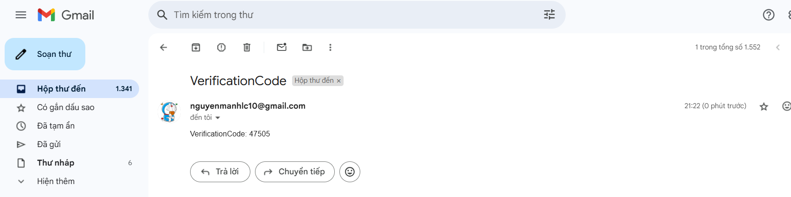

```markdown

## Dự án web bán hàng 
## Cấu trúc source code

ttcs/
└── my-app/
    ├── public/                # Thư mục chứa các file tĩnh (favicon, ảnh, v.v.)
    ├── src/                   # Thư mục mã nguồn chính
    │   ├── assets/            # Tài nguyên tĩnh (ảnh, svg, ...)
    │   ├── components/        # Các component dùng chung và theo chức năng
    │   │   ├── ProductList.jsx
    │   │   ├── DeleteShop/
    │   │   ├── Logout/
    │   │   ├── CreateRating/
    │   │   ├── Order/
    │   │   ├── AddtoCart/
    │   │   ├── DetailProduct/
    │   │   ├── ChangePassword/
    │   │   ├── EditProfile/
    │   │   ├── User/
    │   │   ├── ForgotPassword/
    │   │   ├── EditProduct/
    │   │   ├── DeleteProduct/
    │   │   ├── CreateProduct/
    │   │   ├── InfoShop/
    │   │   ├── EditShop/
    │   │   └── CreateShop/
    │   ├── pages/             # Các trang chính của ứng dụng
    │   │   ├── Cart/
    │   │   ├── Login/
    │   │   ├── Verify/
    │   │   ├── Register/
    │   │   ├── NotFound/
    │   │   ├── About/
    │   │   └── Home/
    │   ├── utils/             # Các hàm tiện ích, xử lý logic chung
    │   │   ├── manager.jsx
    │   │   └── request.jsx
    │   ├── redux/             # Quản lý state với Redux
    │   │   ├── authReducer.jsx
    │   │   └── index.jsx
    │   ├── action/            # Các action cho Redux
    │   │   └── authAction.jsx
    │   ├── hooks/             # Custom React hooks
    │   │   ├── useDebounce.js
    │   │   ├── useToggle.js
    │   │   ├── useLocalStorage.js
    │   │   ├── useClickOutside.js
    │   │   └── useMediaQuery.js
    │   ├── layouts/           # Các layout tổng thể cho trang
    │   │   └── index.jsx
    │   ├── styles/            # Các file style (CSS, SCSS, ...)
    │   ├── App.jsx            # File App chính
    │   ├── App.css            # Style cho App
    │   ├── main.jsx           # Điểm vào của ứng dụng React
    │   └── index.css          # Style tổng thể
    ├── index.html             # File HTML gốc
    ├── package.json           # Thông tin và dependencies của dự án
    ├── package-lock.json      # Quản lý version dependencies
    ├── vite.config.js         # Cấu hình Vite
    ├── eslint.config.js       # Cấu hình ESLint
    └── .gitignore             # Các file/thư mục bị loại trừ khỏi git

## Hướng dẫn cài đặt & Chạy chương trình
•	Backend
o	Sử dụng framework Java Spring Boot nên máy tính cần cài dặt các môi trường cũng như công cụ sau:
	JDK
	Maven
	IDE IntelliJ IDEA
	My SQL workbench
o	Tạo CSDL trên My SQL workbench(tài khoản và mật khẩu trong file application.yml 
o	Chạy chương trình trên IDE Intallij IDEA
•	Frontend
o	Sử dụng ReactJS kết hợp vite nên máy tính cần cài đặt các môi trường cũng như công cụ sau:
	ReactJS
	Node.js
	Visual Studio Code
o	Chạy chương trình, vào thư mục Client
	Bước 1: Cài dependencies bằng Terminal
	npm install
	Bước 2: Chạy chương trình bằng Terminal
	npm run dev
Chạy chương trình
•	Truy cập locahost:5173 để xem website frontend
•	Truy cập locahost:8081 để gọi api backend (có thể dùng Postman để test)
Sử dụng chương trình
a.Giao diện Project khi truy cập 

b.Giao diện khi đăng kí ,đăng nhập

Nhấn vào nút Register ->Shop sẽ chuyển hướng sang trang đăng kí
-Điền đầy đủ các trường ,chọn Role là User nếu là khách hàng ,Manager nếu là Quản lí Shop 
-Sau đó tích vào I agree to the Terms and Conditions ->Sign up
-Giao diện Chuyển sang trang Verify ,nhập mã được gửi đến mail để hoàn tất đăng kí

Khi xác thực thành công giao diện sẽ chuyển hướng sang trang Đăng nhập

b.Chỉnh sửa Profile
+Thay đổi mật khẩu :Nhấn vào Change password giao diện sẽ chuyển sang trang thay đổi mật khẩu 

Note:Giao diện sẽ chuyển hướng sang trang Profile sau khi đổi mật khẩu thành công
+Chỉnh sửa Profile;
Giao diện Profile:

 Nhấn “Chỉnh sửa thông tin” để thay đổi thông tin cá nhân,có thể chọn thêm ảnh,hoặc chỉnh sửa lại các thông tin khác:
Nhấn “Lưu thay đổi “ giao diện chuyển về trang Home:
c.Tìm kiếm,tương tác sản phẩm
+Tìm kiếm sản phẩm :có thể tìm kiếm theo nhiều trường giúp dễ dàng tìm thấy sản phẩm cần thiết :

+Xem chi tiết sản phẩm :nhấn vào sản phẩm muốn xem chi tiết giao diện sẽ hiện ra thông tin chi tiết sản phẩm,shop sản phẩm,commnent,đánh giá:

+Follow Shop 

+Đánh giá về sản phẩm : Nhấn vào “Viết đánh giá”:

c.Giỏ hàng
Sản phẩm trong Shop sẽ tự trừ đi khi người mua “Thêm vào giỏ hàng “:

+Nhấn xóa nếu bạn k muốn mua sản phẩm,Nhâns đặt hàng để mua sản phẩm :
Trạng thái của đơn hàng sẽ được thay đổi và hiện lên thời gian dự kiến đơn hàng bạn nhận được.
d.Tạo Shop ,thêm sửa xóa sản phẩm 
+Nếu bạn k phải là “MANAGER” thì không thể truy cập vào trang để thực hiện hành động
+Nếu là “MANAGER” :

+Tạp cửa hàng :

Nhập thông tin shop của bạn sau đó ấn “Tạo Shop”:
+Xem thông tin cửa hàng:

+Chỉnh sửa Shop nếu muốn thay đổi thông tin :

Nhập xong dữ liệu thì ấn cập nhật Shop sẽ được chỉnh sửa

+Thêm sản phẩm :

Có thể Sửa sản phẩm hoặc Xóa tương tư như Shop 
5.3 Cắt giao diện 
1. Mục tiêu
Mục tiêu của công việc là cắt và dựng giao diện người dùng từ bản thiết kế (Figma) sử dụng Tailwind CSS nhằm đảm bảo tính linh hoạt, dễ bảo trì và tối ưu hiệu suất.
2. Công cụ sử dụng
Tailwind CSS: Framework CSS tiện dụng, hỗ trợ thiết kế giao diện bằng class utility-first.
Figma: Nơi tham khảo thiết kế gốc.
VS Code: Môi trường lập trình chính.
3. Quy trình thực hiện
Phân tích giao diện từ Figma, xác định các thành phần chính như header, navbar, content, footer.
Chuyển các thành phần sang HTML kết hợp class Tailwind để định dạng nhanh chóng.
Áp dụng responsive (phản hồi theo kích thước màn hình) bằng hệ thống breakpoint sẵn có của Tailwind (sm, md, lg, xl, 2xl).
Tối ưu hoá code: tránh lặp class, sử dụng biến màu sắc, padding, margin hợp lý.
Kiểm tra hiển thị trên các trình duyệt phổ biến và thiết bị di động.
4. Kết quả đạt được

Giao diện được dựng đúng theo thiết kế với độ tương thích cao trên các trình duyệt.
Code gọn gàng, dễ bảo trì nhờ việc sử dụng các utility class của Tailwind.
Thời gian hoàn thành nhanh hơn so với việc viết CSS thủ công.


    
